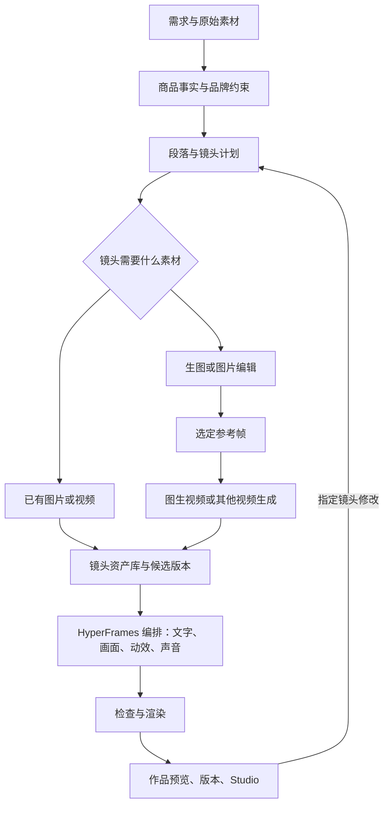

# 商品营销视频 Agent：定义与实施方案

版本 0.6 · 2026-09-09。以用户修订稿为基础，补充竞品参考、多镜头制作和模型/资源接入。产品设计与当前实现状态分别说明。

## 1. 定义与方向

这是一款面向商品营销的垂直视频 Agent：用户描述营销目标，提供商品图片、视频和品牌资料，Agent 调用相关 Skills，组织镜头与素材，生成可编辑的 HyperFrames 工程，完成生成、剪辑、检查和导出。

交付的是一份可以继续修改、复用、追溯的视频作品。模型负责理解、策划、素材生成和修改意图；资源库提供商品材料、品牌约束与模板；HyperFrames 负责画面编排、时间轴、预览和渲染；应用负责各阶段的任务与版本管理。

首个领域仍为商品营销，服务电商商家、品牌运营和小型内容团队。优先覆盖新品介绍、卖点展示、使用说明、活动推广和同商品多版本制作。以 15–120 秒为常用范围；不是只支持三幕广告，也不是不限长度的通用影视工具。更长作品应分章节制作并合成，需另行评估叙事、素材量和渲染能力。

## 2. 三种工作意图，两类核心能力

| 意图 | 输入示例 | 执行内容 | 交付 |
| --- | --- | --- | --- |
| 从素材生成 | “这款咖啡做 60 秒上新视频，先展示包装，再讲风味和冲泡。”附图片/短片 | 解析事实、规划镜头、补素材、编排、混音、检查、渲染 | MP4、分镜、工程、素材和执行记录 |
| 处理已有视频 | “把 40 秒视频剪到 15 秒，保留开箱和特写，加三个卖点。”附原片 | 素材分析、片段选择、裁切/重排、叠加文案、声音与画幅调整 | 新成片、可编辑工程、源片段入出点和剪辑清单 |
| 继续修改 | “第 4 镜换细节图，停留 5 秒；最后一句换成这段话。” | 定位镜头、局部修改、检查依赖、生成新版本 | 新版本及改动记录，旧版保留 |

生成可以组合实拍、生成图片、生成视频、文字、动效和声音。处理已有视频必须能定位与修改源片段，不能只将整条视频嵌进模板便宣称完成智能剪辑。

## 3. 产品形式与使用路径

默认入口保持简洁：**描述需求 + 素材 → 生成视频 → 预览/下载 → 编辑分镜或进入工作台**。描述与上传紧邻，用户不必先完成一张品牌和卖点表。“优化描述”是可选辅助；可选补充与视频设置收起，主界面不呈现模型路由、高级选项或工程阶段代号。

分镜编辑属于结果区。镜头卡显示画面、文案、时长和素材；支持增删、排序、素材选择与单镜头修改。自动生成的镜头必须可编辑；案例进入编辑时建立独立副本。

正式版采用两种执行策略，共用一个入口：已有素材足够时直接生成草稿；需要付费生成大量图片或视频时先形成镜头计划和成本范围，由用户决定是否执行该素材任务。成本确认只发生在具体素材生成前，不要求用户逐步批准所有本地制作操作。

长视频工作区逐步采用紧凑镜头列表加选中镜头详情；几十个镜头不应各自展开一整屏表单。预览可定位到镜头时间点，生成状态与候选选择也属于该镜头。HyperFrames Studio 承接精细时间轴调整。

## 4. 输入与输出

| 输入 | 内容 | 规则 |
| --- | --- | --- |
| 创作要求 | 商品、目标、受众、风格或修改要求的一段话 | 必需；案例可代填 |
| 素材 | 商品图片、已有视频、Logo、声音、参考图 | 生成需可用商品材料；视频处理需源视频/工程 |
| 商品与品牌事实 | 名称、卖点、参数、价格、品牌色、禁用表达 | 从资料提取；没有依据的事实不编造 |
| 制作参数 | 目标时长、比例、画质、节奏、声音 | 采用可见默认值；目标与实际交付明确区分 |
| 修改范围 | 镜头/片段/元素、修改内容、保留内容 | 可从上下文确定则不重复询问 |

品牌、价格和卖点数量不是一概必填。缺少商品识别等阻止制作的信息时，只补问该缺项；不让用户回填完整表单。使用通用文案必须作为创意建议，不能被记录成已验证的商品事实。

交付包包含：MP4、镜头脚本/分镜、HyperFrames 工程、素材清单、目标/实际参数、检查报告和版本关系。处理任务另外包含源素材 ID、入出点、裁切、叠加、声音变化的剪辑清单。

每次版本变更保留 parentId。MP4、工程、分镜和素材选择必须属于同一个版本；手动修改 Studio 副本后若尚未回写，应明确独立导出状态。

## 5. 多镜头与长时长：不仅把三幕拉长

把叙事层级拆成“作品 → 段落 → 镜头 → 元素”。一条 60 秒商品片可以包含开场、商品全貌、细节、使用过程、事实说明与收尾等段落，每段由一个或多个镜头组成。镜头数量取决于信息密度、阅读/旁白时长和可用素材，不应固定为三幕，也不应强制每镜一样长。

| 常用时长 | 当前自动规划 | 正式策划关注点 |
| --- | --- | --- |
| 15 秒 | 4 镜头 | 一个核心信息与明确收尾 |
| 30 秒 | 5 镜头 | 开场、商品、卖点、细节、行动 |
| 60 秒 | 10 镜头 | 增加过程或场景，避免重复卖点 |
| 90 秒 | 15 镜头 | 将内容分段，平衡说明与观看节奏 |
| 120 秒 | 20 镜头 | 需要更充足的实拍/生成素材与叙事内容 |

当前支持编辑为 3–24 镜头，每镜 2–12 秒，总时长 10–180 秒；按 30 fps 帧数累计时间，避免浮点误差导致片尾缺帧。默认时间分配只是可修改的本地规划，不表示具备实时 AI 导演能力。

画面资源分为完整商品、包装/材质细节、使用过程、环境、重点信息、品牌收尾。内容不足时提示素材缺口，不能把同一商品图裁切二十次伪装成二十段真实新镜头。当前 7 种版式改善编排；真正新增动作和场景仍需源视频或生成视频。

提升效果按顺序推进：先提高脚本的信息量，再补充镜头材料，最后调整版式、节奏、字幕和声音。保持商品外观、Logo、颜色与光线连续；实际产品文字和行动文案在 HyperFrames 叠加，便于准确修改。

## 6. 为什么以 HyperFrames 为核心

| 领域需求 | HyperFrames 的作用 | 价值 |
| --- | --- | --- |
| 商品名、卖点、价格需准确 | HTML 文本与布局进入工程 | 文案可核对、替换，不依赖模型把文字画对 |
| 品牌版式重复使用 | HTML/CSS 与 GSAP 封装成可复用布局/动画 | 减少重复搭建，保持系列一致 |
| 经常只改某一镜 | 用镜头/元素 ID 定位，保留工程 | 文案或版式修改无需重新生成素材 |
| 自动制作后人工接手 | 同一工程可在 Studio 中继续预览与编辑 | 有可交接的创作载体 |
| 混合素材统一交付 | 编排图片、视频、文字、动效与声音 | 模型只生产所需素材，作品保持统一 |

HyperFrames 不自动提供领域 Agent、品牌知识库、多模型路由、队列或版本管理，这些属于应用层。它也不能保证视频模型生成的商品外观正确，仍需参考资产约束和结果检查。

可编辑工程不等于免费局部渲染：本轮保存修改仍重新渲染整片；正式版可缓存单镜头中间片，减少未变镜头的重算，但要解决转场、声音和跨镜动画依赖。FFmpeg 适合探测、预处理、声音与最终编码，不替代内容理解与编辑工作区。

代价包括模板维护、浏览器渲染负载、多规格版式适配与引擎版本兼容。主张“准确修改与可接手”，而非未经验证地承诺比所有方案更便宜或画质更好。

## 7. 从竞品中采纳的设计

Invideo 将镜头与可编辑时间轴结合，其分镜工具允许选定参考帧后继续生成视频；适合借鉴“先确定画面，再生成运动”的过程。[Invideo 编辑器](https://invideo.io/make/agentic-video-editor/)、[分镜帮助](https://help.invideo.io/en/articles/14754413-creating-storyboards-with-invideo)

Creatify 的商品输入与广告变体思路适合本领域；Runway Workflows 的节点连接和候选历史适合放到后台资源依赖中；Descript Underlord 的按时间编辑和执行计划适合修改任务。我们借鉴工作方式，不把它们的公开宣传视为效果实测。[Creatify](https://creatify.ai/)、[Runway Workflows](https://help.runwayml.com/hc/en-us/articles/45769159004691-Building-your-first-Workflows)、[Descript](https://feedback.descript.com/changelog/announcingunderlord-v2)

详细取舍与后续对照任务见 `video-agent-competitive-review.md`。本轮调研来自官方页面，未进行这些竞品的登录付费实测。

## 8. 框架与模型接入

### 8.1 明确区分四种接入对象

**模型**执行理解、生成或分析；**工具/API**执行明确动作；**Skill**定义任务方法、输入输出和验收条件；**插件/MCP**封装能力、权限与调用入口。装了插件不代表本地 Web 后端已能调用其模型；在 Codex 中可用的工具也不能假定能被后台 Node 服务直接复用。

开发演示阶段可以由 Codex 调用会话内能力生产样例素材，再导入项目；正式运行采用服务端提供方适配器，独立配置凭据、任务状态和费用。前端不持有密钥，也不通过模拟点击第三方网页承担长期生产链路。

### 8.2 生图模型

首批接入 OpenAI GPT Image 的图片生成与编辑。官方文档提供 Image API 和 Responses 的连续编辑工作流：前者适合独立素材任务，后者适合围绕参考图多轮修改。具体可用模型在接入时核验并配置，不把会话模型名当作图片引擎名。[OpenAI 图像生成文档](https://developers.openai.com/api/docs/guides/image-generation)

用途包括商品参考图衍生、环境画面、包装展示背景和视频首帧。每次任务输入商品参考资产、目标镜头、允许/禁止变化、画幅和品牌规范，输出候选图及来源记录。Logo、包装文字、商品形状、颜色是必须复核的要素。能通过背景合成实现的需求，优先保留原商品主体，不反复重画商品。

图片定稿后进入资产库；它可成为 HyperFrames 静态镜头素材，也可作为图生视频的参考帧。原始素材与生成素材分别标注，不覆盖用户上传文件。

### 8.3 生视频模型

视频生成以镜头为单位。输入参考图/首帧、镜头动作、摄影机运动、目标时长、画幅、连续性约束；输出一段候选视频，再由 HyperFrames 编排成完整作品。

Runway 和 Veo 作为首批评估对象：各自具有视频任务与参考素材接口，但可接受的模型、时长、尺寸和参考图条件不同，适配器必须分别验证。[Runway API](https://docs.dev.runwayml.com/api/)、[Veo 文档](https://ai.google.dev/gemini-api/docs/veo?hl=en)

OpenAI 官方已标记 Sora API 计划于 **2026-09-24** 停用，因此当前不将 Sora 作为新系统默认视频提供方；OpenAI 文本与生图路线可以独立保留。[官方 API 页面](https://developers.openai.com/api/reference/typescript/resources/videos/methods/create)

若某模型只接受较短片段，先根据镜头内容拆分或重新规划，不简单拉伸画面；需要拼接时处理动作衔接、画幅、帧率和声音。并非所有镜头都需要生视频：商品字幕、信息页、片尾与部分素材展示用 HyperFrames 即可完成。

### 8.4 文本、多模态与声音

Codex 用于工程开发与受约束的工程修改；可用的 GPT 文本/多模态模型负责事实整理、镜头计划、修改意图及素材判断。输出必须经过结构校验，不能直接让模型输出覆盖任意文件。

旁白按镜头脚本生成或导入，转写对齐到时间轴；音乐、旁白、音效分轨。旁白超出镜头时长时优先改文案或调时长，不能默认加速到难以理解。本轮只实现配乐按真实时长循环与首尾淡入淡出，尚未接实时语音服务。

### 8.5 提供方适配契约与任务状态

统一业务请求为 `GenerationRequest`，包含 `projectId / shotId / capability / prompt / references / constraints / budget / timeout / idempotencyKey`。适配器将它转换成各 API 参数，返回 `providerTaskId / status / artifacts / usage / error`。

能力清单记录：支持的输入/输出类型、时长与画幅、参考图限制、声音能力、异步方式、取消与幂等支持、账号是否已验证。**没有该能力就拒绝或改计划，不静默忽略参数。**

任务流程为 planned → submitted → running → succeeded/failed/cancelled。每镜独立持久化，异步结果通过 webhook 或有界退避轮询收取。区分提交超时与生成失败：提交结果不明时先查已有任务，避免重复付费。只有确认可重试的错误才自动重试，保留每次实际费用与输出。

成本控制先计算将新增的素材数、候选数与目标秒数，设置项目和镜头预算。修改文字只改工程，换参考图仅失效下游视频。远程素材链接需在有效期内按提供方约定收取并记录校验值。

## 9. 资源、工具、插件和 Skills

### 资源层

品牌包保存 Logo、色板、字体、语气和约束；商品包保存事实、原始图片、视频、参数和来源；素材库保存候选图/视频、声音、来源、使用范围、模型及生成参数；模板库保存版式、动效、适用画幅、字数限制和测试样本。

镜头引用 `assetId`，不直接依赖临时远程 URL。资源记录 `sourceType / sourceId / checksum / mediaInfo / rights / selectedVersion / generatedBy`。用户素材优先；自建资源其次；经许可的外部素材或生成素材按需补充。不要把任意网页图片默认为可商用资源。

### 工具与插件层

| 能力 | 接入形式 | 当前/计划 |
| --- | --- | --- |
| HyperFrames 编排、检查、渲染、Studio | 本地 CLI、相关 Skills | 已可用 |
| 媒体探测、转码、配乐时长处理 | FFmpeg / ffprobe | 已可用 |
| 图片规范化、尺寸校验 | Sharp | 已可用 |
| GPT Image 生图/编辑 | 正式版服务端 OpenAI API；演示可使用会话内 imagegen 产素材 | 实时 Web 接入待实施 |
| 视频生成 | Runway/Veo 等提供方 API 适配器 | 待凭据、能力和样例验证 |
| 品牌/设计资产 | 自建品牌包；必要时接 Canva 等连接器 | Canva 工具在会话可用，不等于已接入应用 |
| 外部素材库 | 经许可的数据接口或资源导入 | 待资源策略与授权确定 |
| 插件打包 | 将领域 Skills、工具定义与配置统一打包 | 后续交付形式；不代替服务端队列与凭据管理 |

本轮不为凑齐清单自动安装插件。是否需要 Runway 等插件，取决于最终运行在 Codex 会话内还是独立 Web 服务；后者通常直接使用稳定 API。

### 领域 Skills

| Skill | 输入 → 输出 | 质量要求 |
| --- | --- | --- |
| 商品需求理解 | 描述/资料 → 事实、创意建议、缺项 | 不混淆事实与推测 |
| 镜头策划 | 目标/时长/资源 → 有序镜头、时长、素材缺口 | 每镜有目的；长片不重复填充 |
| 商品视觉准备 | 原图/品牌约束 → 参考图和可用素材 | 保持外观与标识；来源明确 |
| 图像生成与编辑 | 镜头/参考资产 → 候选图 | 不覆盖原图；可比较、可选定 |
| 视频镜头生成 | 参考帧/运动要求 → 候选片段 | 动作、外观、时长与规格可检查 |
| HyperFrames 编排 | 选定素材/分镜 → 可编辑工程 | 元素 ID 稳定；文案准确；时间轴一致 |
| 镜头与视频修改 | 修改指令/工程/源视频 → 编辑清单、新版本 | 保留非目标内容；变更可追溯 |
| 声音与字幕 | 旁白/配乐/镜头 → 分轨声音和字幕时间 | 不截断旁白；音轨不过载 |
| 质量检查与交付 | 工程/成片 → 技术、事实、视觉检查与交付包 | 无缺素材、黑帧、越界；规格明确 |

这些是需要实现的领域能力契约，不意味着列出 Skill 名称就已有实现。现有 HyperFrames/GSAP/CLI 基础 Skills 继续复用，领域规则以可测试的小任务逐步补齐。

## 10. 当前交付与后续范围

| 能力 | v0.6 已实现 | 待实施 |
| --- | --- | --- |
| 输入 | 一段话、本地整理、可选补充、1–12 张图片 | 实时模型、视频/声音导入与理解 |
| 镜头与时长 | 15/30/60/90/120 秒真实生成；3–24 镜头编辑；总时长随编辑变化 | 按叙事/素材/旁白智能分配 |
| 镜头操作 | 文案、时长、排序、增删、图片和 7 种版式 | 单镜头候选生成、视频裁切、对话修改 |
| 声音 | 配乐覆盖实际时长并淡入淡出 | 实时配音、字幕对齐、多音轨混音 |
| 输出规格 | 横屏 1280×720；旧版项目继续可读 | 竖屏/方形及其他画质的真实适配 |
| 成片和版本 | 检查、MP4、分镜、历史项目与 Studio 副本 | 工程打包、Studio 回写、镜头渲染缓存 |
| 模型集成 | 方案、提供方契约、能力配置示例 | 独立 Web 后端的实时生图/生视频 |
| 竞品研究 | 官方资料对比与明确设计取舍 | 同素材、同要求的付费实测 |

新增长片示例用于验证容量、镜头编排与编辑，不冒充生视频模型生成的新摄影素材。多图/多镜头的支持为接入动态素材建立基础，但视频处理闭环仍需单独实施。

## 11. 价值与验证

价值在于用较少的输入得到可修改的商品作品，复用素材和品牌约束，并以可检查的方式完成版本迭代。需要实际验证：首次草稿成功率、修改完成时间、非目标变更、商品外观一致性、每条片子的素材生成次数与费用。

验收任务应包含：30/60/120 秒成片；至少三种镜头形式；同一商品多素材；只改指定镜头；生成失败后保留其他镜头；Studio 接手；真实原视频裁切任务。技术检查之外，人工观看商品标识、画面连续性、节奏、旁白与声音，长时长不自动代表好效果。

最新本地验收见 [验收记录](video-agent/docs/acceptance-2026-09-09.md) 和 `video-agent/outputs/acceptance-latest.json`，包含真实 Chrome 操作、真实渲染、历史版本保留及异常恢复。正式长片与旧案例复核见 `video-agent/outputs/release-smoke.json`。`video-agent/outputs/v6-tests.json` 保留为历史记录。当前未完成的模型付费生成、竞品实测和投放指标，不填写结果或节省比例。

## 12. 实施顺序

1. 解除固定三幕和时长限制，建立镜头级编辑与长片交付（本轮）。
2. 接素材清单与品牌包，完善视频导入、镜头预览和真实画幅适配。
3. 接一套生图 API 和一套生视频 API，先跑通“参考图 → 单镜头 → HyperFrames 成片 → 改这一镜”的完整循环。
4. 补齐已有视频的裁切/重排、声音和字幕，再扩展其他模型与模板。
5. 用同素材任务评测质量、修改准确性和成本，验证后再做批量变体与服务化。

设计契约见 `video-agent/docs/model-integration.md`；竞品资料见 `video-agent-competitive-review.md`；本地使用见 `video-agent/LOCAL-DEMO.md`。现有 Agent SOP 与从 0 到 1 文档继续作为输入输出、状态、评测和版本管理的基础。
