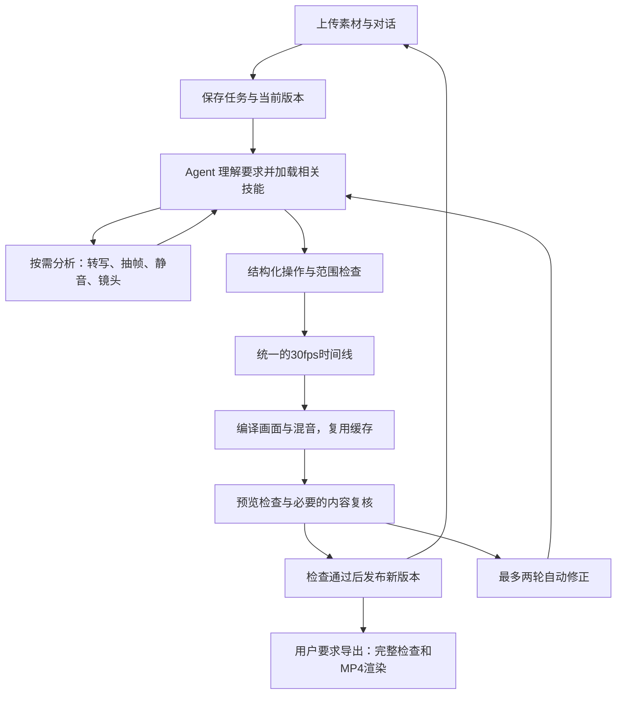

# HyperFrames、ChatCut 与这个对话剪辑 Agent

这三个部分承担不同工作：**HyperFrames 把安排好的画面和声音做成视频；ChatCut 展示“和 AI 一起剪片”的产品工作方式；本项目 Agent 根据你的要求安排剪法，并调用工具执行。** 剪辑质量主要取决于理解素材、选对内容、处理时间与声音，以及能否发现自己的错误。

本文依据 2026 年 9 月 10 日查看的公开资料和当前项目代码。公开产品能力与本项目实际接入能力分别说明；实验、真实模型运行和人工质量评审不混为一谈。

## HyperFrames 怎样把网页变成视频

可以把一个合成工程看作“带时间说明的画面布局”：视频、字幕、标题各有开始和结束时刻，动画也能定位到某一时刻。浏览器负责把这一时刻画出来，渲染引擎逐帧获取画面，再交给 FFmpeg 编码；音轨另行混合。公开引擎基于 Puppeteer、浏览器与 FFmpeg，支持可定位时间的网页内容。[HyperFrames 引擎说明](https://github.com/heygen-com/hyperframes/blob/main/packages/engine/README.md)

在本项目里，你不用写网页。执行器先生成一份时间线，再将其编译为 HTML、媒体引用和 GSAP 时间动画。比如“第 2～5 秒显示一句话”，在 30fps 下就是第 60～150 帧显示字幕。播放预览和导出都来自这份安排，减少两个结果互不相同的机会。项目固定使用 HyperFrames 0.8.33，不能直接假定网上最新版本的每项能力已经可用。

“模型认为这里应该剪掉”和“工具确实删掉正确的帧”是两件事。模型负责前者；整数帧时间线、范围校验与媒体工具负责后者。FFmpeg 会裁切、变速、混音，但不会自动理解哪句话最能表达观点。模型能理解文字和抽帧，但不能仅凭描述证明整段成片已经正确。

## ChatCut 的可借鉴之处，以及公开资料没有说明的事

ChatCut 的官方介绍把它定位为有 AI Agent 的视频编辑工作台：用户提供素材、用自然语言要求剪辑、查看结果，仍可在多轨时间线上手动调整。它也公开提供外部 Agent 插件，让外部对话入口操作同一个可编辑工程。[ChatCut 产品介绍](https://chatcut.io/docs/what-is-chatcut)、[Agent 插件说明](https://chatcut.io/docs/agent-plugin)

官方界面资料展示了聊天、素材、预览、时间线和版本入口；工作区可调整布局。教程中的常见任务卡片用于填写输入框，用户仍需发送才开始操作；执行进度和追问出现在对话里，修改可以撤销。[界面说明](https://chatcut.io/docs/editor-overview)、[首次剪辑流程](https://chatcut.io/docs/quickstart)

这些公开资料能证明交互与功能，**不能证明 ChatCut 的私有后端采用了哪种数据库、内部时间线格式、模型路由、缓存算法或调度实现，也没有据此确认其内部使用 HyperFrames**。这里借鉴的是可见工作流，不将本项目架构描述为 ChatCut 的内部源码复刻。

| 环节 | ChatCut 公开工作流 | 本项目的具体选择 |
|---|---|---|
| 开始 | 打开工程并加入素材 | 上传一个或多个素材，先获得可播放预览 |
| 提要求 | 在 AI 区描述修改并附参考 | 一个聊天输入框贯穿裁切、字幕、配音、修改和导出 |
| 引用内容 | 素材、文字稿或选区帮助定位 | 通过素材 ID、当前画面、时间范围和文字稿引用明确目标 |
| 执行 | Agent 修改可编辑时间线 | 模型给结构化操作，应用校验并执行受支持的操作 |
| 确认 | 播放、调整、撤销及版本管理 | 显示修改说明、预览、撤销与恢复，保留历史成片 |
| 导出 | 用户选择交付内容 | 当前阶段以 MP4 为主，导出固定到指定版本 |
| 丰富能力 | 产品公开列出多种生成能力 | 五个项目技能与受控工具；额外生成服务需要实际配置 |

本项目默认收敛为聊天与预览，时间线作为内部精确表示存在。简单界面没有消除剪辑复杂度，只是把复杂度交给 Agent、工具和检查过程处理。

## 本项目每一层怎样配合

**素材层**保存原片、用于工作和播放的媒体、缩略图及按需生成的分析结果。素材哈希就像内容的指纹：同一份内容不应因换文件名就重新分析。上传不再必须等转写和密集分析全部完成，明确的秒数裁切也不需要先了解整部片子。

**规划层**默认通过本机已登录 ChatGPT 的 Codex CLI 获取剪辑计划。它得到用户要求、当前时间线、真实素材信息、最近对话和相关技能，返回一份 JSON 操作清单。它不能把素材中出现的文字当作系统指令，也不能直接把任意 shell 命令交给媒体执行器。云 API 是可选连接方式，不把 Codex 订阅伪装成免费的语音或视频生成 API。

**时间线层**用稳定 ID 表示片段、字幕和音轨，明确源范围、成片位置、持续帧数、播放速度、轨道与取景。一次请求的时间默认基于同一基础版本，再统一计算结果。这样“删开头，同时移动片段和加片尾标题”不需要用户人为拆成几轮，也不会因重复前移字幕而错位。

图层可以跟随源内容，也可以固定在成片位置或跟随片尾。讲话字幕适合随源内容移动；“最后三秒显示谢谢观看”适合跟随片尾。倍速会影响画面持续时间，同时要处理声音速度与字幕映射。转场有真实重叠帧数，不能仅添加一个看起来像转场的标记。

**执行与缓存层**调用受控 FFmpeg、语音和 HyperFrames 工具。只改字时复用没有变化的声音；撤销复用历史版本资源；相同配音请求复用实际 WAV。ASR 与 TTS 各用常驻 Python worker，同一资源内串行请求、不同资源可分开工作；取消活动请求只结束相关进程，队列里的下个任务仍能启动。

**版本与检查层**先在独立工程里编译、检查，成功后才改变当前版本指针。失败继续保留上一版。编辑与导出分开排队；导出旧版时，你仍可以继续提出下一轮修改，旧版导出完成也不会替换当前预览。最终导出执行完整检查，并使用严格渲染选项，缺失媒体不能被当作正常成片。

## 一条要求怎样变成具体操作

可以在已导入的 90 秒素材上发送：

> 只保留前35秒，在最后3秒添加“故事还在继续”；第1秒加入中文旁白“现在，让我们看看接下来会发生什么。”并添加同文字幕，原声音量降为百分之十五。

下面是依据当前代码的执行路径说明。真实 11 步连续运行（含字幕、倍速、多素材、旁白、配乐、导出中继续编辑）保存在 `outputs/upgrade/live/run.json`；下面的复合示例仍是执行路径说明，不把它与那组固定验收指令混为同一条人工质量样片。

1. 服务保存消息和基础版本，立即返回任务 ID；界面可以显示实际执行阶段。
2. Agent 读取素材与时间线，只加载与时间、字幕和声音有关的技能。因为源范围与台词已经明确，不必先做全文视觉分析。
3. 规划结果包含保留 0～1050 帧、新增旁白、为 `new_voice` 生成同文字幕、调整原声音量。片尾标题按基础版本的最后三秒设置 `anchor=end`，执行器把它放到最终第 32～35 秒。
4. 语音引擎生成用户给出的原文，再测量实际时长。语速由真实合成参数控制。如果指定范围放不下声音，返回具体时长冲突，不伪造压缩成功。
5. 执行器同步处理视频、声音和字幕；普通文字字幕不会触发额外朗读。只与生成旁白明确关联的字幕改词，才重新生成对应旁白。
6. 工程编译、预览检查和必要内容复核通过后发布新版本，回复改动说明。用户播放修改位置，必要时继续改。
7. 用户发送“导出”时，对指定版本完整检查并渲染 MP4。导出期间新的聊天修改可以继续进行。

语义任务会多一步：如“删重复表达，保留结论”，必须先看真实转写和画面证据，检测只是候选参考。生成方案后检查剪点是否切进词语，并抽查保留片段的源画面。自动复核会记录看过哪些证据；没有听完整声音，就不能声称完成了人工听音评审。

## 五个已接入的 skills

Skill 可以理解为“某类工作的操作说明与检查要点”。它本身不会让软件突然拥有新工具；只有被应用注册、接入执行器并验证过的动作才能执行。项目加载的是经过适配的说明，上游原始快照与许可证另外保存供追溯，不直接执行下载仓库里的任意命令。

配置入口为 `config/skills/registry.json`；每项记录本地版本、上游地址、固定 commit、许可证、依赖、可调用动作与成功条件。当前 5 项本地适配版本均为 1.0.0，兼容目标是本项目 HyperFrames 0.8.33 与 FFmpeg 4.1 以上的已验证子集。

| 项目技能 | 已接入用途 | 固定上游与许可 | 需要注意 |
|---|---|---|---|
| `timeline-edit` | 裁切、保留、重排、插入、倍速、取景和导出意图 | [ffmpeg-skill](https://github.com/kajisho5/ffmpeg-skill/tree/ae3627595b66497b5d247daffcae17f4a035cfbc)，MIT | 使用项目结构化工具，不承诺兼容上游全部脚本 |
| `speech-captions` | 转写字幕、文字修改、旁白、明确关联字幕的同步 | [HyperFrames](https://github.com/heygen-com/hyperframes/tree/26916b7bddbcc2ef782a59bd31c79801ff5258b4)，Apache-2.0 | 普通字幕不朗读；烧录文字不能当可编辑字幕直接修改 |
| `visual-composition` | 画幅、裁切、画中画、叠层、相邻片段转场 | [HyperFrames](https://github.com/heygen-com/hyperframes/tree/26916b7bddbcc2ef782a59bd31c79801ff5258b4)，Apache-2.0 | 仅暴露已支持的时间线行为，不宣称任意运镜或视频生成 |
| `audio-mix` | 配乐、音量、人声压低、淡变、整体响度 | [ffmpeg-skill](https://github.com/kajisho5/ffmpeg-skill/tree/ae3627595b66497b5d247daffcae17f4a035cfbc)，MIT | 音量处理不能修复所有噪声；不能用文字检查代替听音 |
| `rough-cut` | 静音候选、镜头边界、按内容粗剪的操作原则 | [Auto-Editor](https://github.com/WyattBlue/auto-editor/tree/8db9eb0c612600644a9a63cdbbba542b661ca847)，Unlicense | 使用内置 FFmpeg 与可选 PySceneDetect；Auto-Editor CLI 没有整套接入 |

静音检测发现的是“声音小于阈值的一段”，不是“不重要的一段”；镜头检测发现的是画面变化，也不等于精彩片段。最容易失败的地方往往是语义判断、中文同音字、上下文遗漏、复杂取景和声音质量。因此要保留可追溯证据及人工对照评测。

## 可选能力怎样配置

默认剪辑规划使用 Codex 登录；默认本地转写为 Whisper small，中文配音为 HyperFrames 安装的 Kokoro 模型配合 Misaki 中文发音处理。模型与必要 Python 包必须已经在指定环境内，未安装时会给出明确未配置错误。下面的环境变量影响启动后的服务，不把密钥写入前端或文档。

| 配置 | 作用 |
|---|---|
| `VIDEO_AGENT_CODEX_BIN`、`VIDEO_AGENT_CODEX_MODEL` | 指定本机 Codex 可执行文件与已有权限的模型，未显式指定时由当前 Codex CLI 选择默认模型，不硬编码私有模型名 |
| `VIDEO_AGENT_PYTHON` 或 `HYPERFRAMES_PYTHON` | 指定安装了语音依赖的 Python |
| `VIDEO_AGENT_WHISPER_MODEL` | 切换本地转写模型；更大的模型通常需要更多时间和内存，必须实测 |
| `VIDEO_AGENT_ASR_ENGINE=whisperx` | 使用安装好的 WhisperX 转写与对齐，默认仍为 faster-whisper |
| `VIDEO_AGENT_SCENE_ENGINE=pyscenedetect` | 使用安装好的 PySceneDetect；默认内置 FFmpeg 镜头检测 |
| `VIDEO_AGENT_TTS_ENGINE=elevenlabs` | 使用 ElevenLabs 语音适配器，同时配置 `ELEVENLABS_API_KEY` 和 `ELEVENLABS_VOICE_ID` |
| `VIDEO_AGENT_GENERATION_URL`、可选 `VIDEO_AGENT_GENERATION_KEY` | 外部素材生成提供方接口；没有配置时不会宣称已经生成视频 |
| `VIDEO_AGENT_CACHE_ROOT` | 语音与转写缓存根目录，可用于隔离验证数据 |
| `VIDEO_AGENT_EDIT_PROVIDER=openai` | 使用应用的云 API 提供方而非默认订阅连接；需要单独 API 配置 |

本地支持的中文音色 ID 包括 `zf_xiaobei`、`zf_xiaoni`、`zf_xiaoxiao`、`zf_xiaoyi`、`zm_yunjian`、`zm_yunxi`、`zm_yunxia`、`zm_yunyang`。本地语速范围为 0.5～2；不承诺任意情绪模仿和音色克隆。ElevenLabs 适配器采用 0.7～1.2 的速度范围；配置存在只表示能尝试连接，不表示服务已被实际验证。[ElevenLabs 速度说明](https://elevenlabs.io/docs/help-center/product/core-capabilities/text-to-speech/can-i-change-the-pace-of-the-voice)

外部生成适配器的最小约定是向配置地址 POST `{prompt, kind, durationSeconds}`，返回 `{url, mimeType, attribution?}`。接口返回的是可导入素材，不绕过素材校验直接改时间线；当前已接入安全下载、大小/MIME/取消校验和重新规划，未配置时明确提示缺少能力。

## 已有验证与还需要补齐的质量证据

**以下两段是此前 Windows 实验留下的记录，不是本次续作重新测得的数据。对应大文件/报告未随当前仓库完整提供，本次未复核，不计入本次通过项或性能对照。**

此前记录使用一句约 5.48 秒的中文旁白：冷启动生成约 13.6 秒，常驻模型后新语速或音色约 3 秒，相同请求缓存约 55 毫秒。语速 1.3 倍时实际音频缩短为约 4.38 秒；男声也生成了不同音频。这是单条素材实验，不是所有任务的 p50/p95。报告：`outputs/upgrade/actual-speech-1789005693572/report.json`。

此前记录中，同一句话转写首次约 14.35 秒，缓存约 4 毫秒；三秒纯静音明确返回 `no_speech`。转写把原文“语速和音色”识为“与素合音色”，说明仍需要中文校对。报告：`outputs/upgrade/actual-asr-1789005791075/report.json`。生成旁白的字幕可以优先使用已知台词，但未知原声不能这样“猜正确答案”。

工程测试另覆盖结构化接口、字幕不意外发声、缓存、取消与超时、真实静音/镜头检测、源画面检查等。测试通过说明这些约束按预期工作；它不证明复杂语义剪辑的美感达到专家水平，也不能替代本轮真实模型端到端运行。

达到“熟练使用 HyperFrames 的专家为 100，Agent 达到 85”的证据，应来自 [24 项盲评基准](evaluation/README.md)：相同素材与要求、专家和 Agent 各自成片、两位真人独立随机盲评、保留集不参与调优。当前评分输入默认 pending；没有专家片和双人评分，就不会在报告中写“已达到 85 分”。

## 2026-09-10 续作：哪些要求不用再等模型

现在分成两条执行路径。明确的字幕新增/改词、数字时间范围裁切、原声音量、可安全同步的全片倍速、导出等，由严格匹配的本地工具直接执行。不匹配的附加条件、带引用的要求、旁白绑定、复杂同步与语义判断，仍交给模型规划。不会为了快而把不认识的半句话丢掉。

例如“在第 2.033 秒到第 5 秒添加底部字幕「对话剪辑测试」”：服务先保存任务和基础版本，换算到第 61～150 帧，产生 `caption_add`，通过同一个时间线执行器编译、检查并发布版本。普通字幕不会创建语音，未改变的声音直接复用。命中这条路径时报告明确记录 `modelCalls=0`，而不是声称模型一瞬间完成了理解。30fps 只能按帧表示时间，实际显示起点为 61/30 秒。

随后“把字幕「对话剪辑测试」改为「只改文字，不加配音」”只更新唯一匹配的字幕组。如果相同文字对应多个组，或字幕绑定了合成旁白，就不能猜测目标或绕过声音检查。

此路径解决等待和确定性执行，不等于替代剪辑师。让 Agent 达到专家相对 85 分，主要还要依靠素材证据、选段与叙事判断、可审计工具调用、听音与画面检查、盲评反馈；增加技能说明文件本身并不能证明质量提高。具体变更、已执行测试与缺口见 [续作验收](续作验收-2026-09-10.md)。
