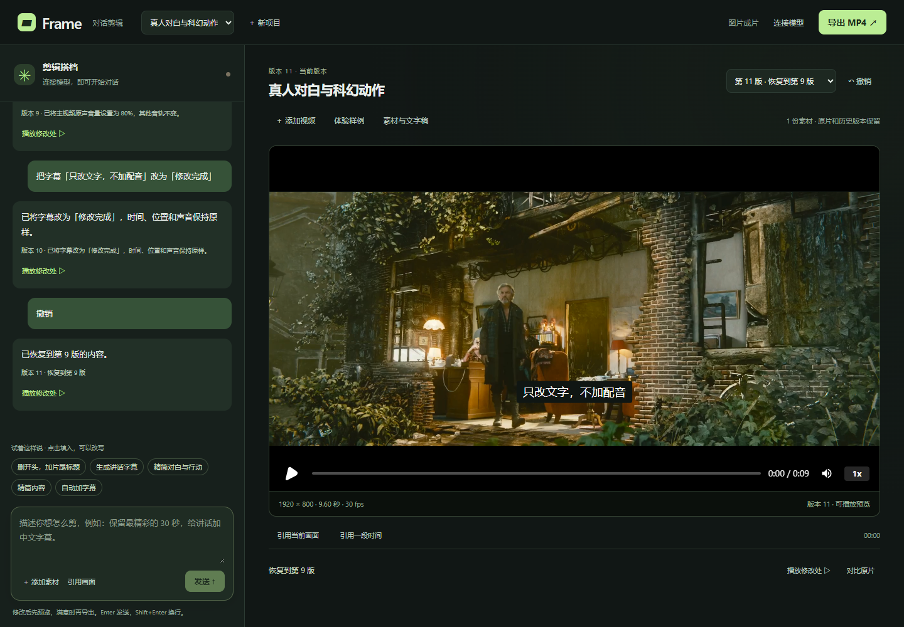

# 最终全局审查与测试（2026-09-10）

本轮以 GitHub main 的 2a3fca7 为基线，按 cb176bc 共同基础完成三方比对与融合。修复后本机工程回归通过，可以提交当前实现；**不代表全部产品目标已经完成，也未证明达到专家相对 85 分**。

## 本轮发现与处理

- 此前工作区没有完整保留远端续作：恢复 CI、跨平台媒体/Python 路径、Codex 完整提示词 stdin 传递和默认模型策略、导入独立调度、ZIP 成功后再发布导出状态。保留本地语音活动检测、字幕加速、原子保存及素材证据修复。三个冲突文件已逐项合并。
- 字幕与旁白分离；已知中文旁白生成同语言字幕可跳过重复识别和翻译。音乐压低优先使用本地 Silero 人声区间，避免为混音执行完整语义分析。
- 缓存拒绝空清单、缺失产物及越界路径；并发等待后再次验证。Windows 短暂文件锁重试原子替换，失败保留此前元数据。
- 镜头证据限定实际抽帧时间；非法结果最多修正两次。字幕结束时间按整数帧检查，避免浮点边界误报。
- 首帧检查原来只等播放器 ready，可能过早截图。本轮补充真实视频解码、像素变化和可见性断言；首帧在 ready 后约 693ms 显示，刷新后画面也已核对。预览测试去掉本机固定日期目录，缺少参考时可生成测试参考。
- 早期 /create 验收仍断言旧版本号、写死本机 Chrome 路径，已改为当前契约与环境路径；19 项回归通过。
- 普通话原发布文件 117,481,288 字节超过 GitHub 100 MiB 限制，已从原始来源重新编码为 58,979,388 字节，保留 1920×1080、30fps、5768 帧和音轨，通过全片解码。使用有损 CRF 25；原始来源与旧准备文件保留在本机，来源记录和哈希已更新。
- 移除已跟踪 Python 字节码，保留本机文件并加入忽略。提交不含用户项目、密钥、本机配置、下载源文件或运行缓存。评测输入改为项目相对路径。
- 修正文档中的自动朗读、自动导出和文章创作能力承诺；旧记录明确标为历史。

## 测试与证据

环境：Windows x64、i5-1334U、16GB、Node 24.19.0、HyperFrames 0.8.33。下列测试在合并后的代码运行。详细机器可读记录见 [汇总 JSON](evidence/final-review-2026-09-10.json)。

| 检查 | 结果与范围 |
|---|---|
| 核心回归 | 10 个测试套件通过，包含时间线、规划、服务、翻译、盲评程序、缓存/路径/ZIP、精确指令、词边界、原子保存与证据修正。构建通过。 |
| 浏览器与媒体 | 桌面/手机、刷新重试、取消恢复、导出并行、多素材、变速、裁切、画中画、转场、音量、响度、音频压低及严格导出通过。 |
| 预览专项 | 7 组通过：对照严格 MP4、缓存与浏览器复用、边界采样、运行异常与溢出、字幕帧边界、取消及空闲后恢复。旧未标记色彩源仍有浏览器/FFmpeg 数值差异；不能宣称像素完全一致。 |
| 十轮真实聊天 | 真人影片经真实 HTTP、界面、FFmpeg、HyperFrames 完成；本地精确指令无需模型。九轮编辑约 1.65～3.94 秒，撤销约 0.68 秒，包含播放器 ready 等待。另验首帧真实显示。最终 9.6 秒 MP4 和 ZIP 可下载，旧导出不覆盖新预览。 |
| /create 及服务 | npm test：19 项通过。包含 Host/Origin、非法请求、伪造图片、越界访问、Range/HEAD、重启和七种版式实际渲染。 |
| 基础编辑兼容 | npm run test:edit：15 项时间线与 7 项 provider 契约通过；provider 为模拟传输，不算真实模型。 |
| 本地语音活动 | 真实 221.8 秒录屏检测通过；准备约 3.15 秒、冷检测约 3.11 秒、缓存 12ms。此次并行负载下结果不替代固定条件性能基准。 |
| HyperFrames 全量检查 | npm run check 通过：0 错误，40/40 对比度检查通过。历史商品 composition 留有 1 项重复图像 warning 和 2 项转场重叠 info，已审阅，未把它们写为零警告。 |
| C04 语义成片复导 | 先前真实模型生成并复核的版本，本轮隔离复制后严格导出成功：37.533 秒、1920×800、1126 帧、H.264/AAC，约 125 秒。没有重新规划，没有人工质量分。原超时记录保留。 |
| 新真实订阅请求 | 失败：模型容量繁忙，约 10.2 秒返回明确错误。没有隐藏失败、伪造成功或改为收费 API。 |
| 提交检查 | 改动 JS/MJS 语法、冲突标记、差异空白、文件大小和常见凭据模式检查；未检出语法错误、残留冲突或疑似密钥。依赖锁与固定版本一致。 |

本机输出均保留在 outputs/upgrade 和 outputs/acceptance。Git 中保存测试脚本与汇总，不上传用户运行数据。CI 保留 Windows/Linux 两个平台；本机通过不能预先代表本提交 CI 已通过。

截图影片署名：(CC) Blender Foundation | mango.blender.org，Tears of Steel，CC BY 3.0；图片展示测试编辑后的片段。

## 仍未达到的产品目标

1. 85 分门槛未验收：缺少 24 个完整 Agent/专家对照成片及至少两位真人评分，不能用测试通过率代替。
2. 纯主题/文章到整条视频尚未实现；零素材项目、脚本定稿工作流、图片素材轨及自由 HTML 动效创作还不在当前受控操作集内。见 [真实能力边界](零基础自动剪辑工作流.md)。
3. 常用精确指令显著加速，但一般模型请求的 p95 20 秒目标未达到；模型容量/网络仍会影响首次语义任务。本地语音的发音、转写准确率和叙事质量需要真人检查。
4. 外部生成、WhisperX、云配音属于可选接入，未配置服务不计为已实测。

普通话发布副本重新编码后已单独冻结新的 24 项素材基准：outputs/upgrade/benchmark.release-2026-09-10.json，SHA-256 d184e8759482742c111013647132cd1a683a6e430626ba29668a4e53d6d4635c。旧冻结报告不得直接与新副本混用；旧原始文件和记录保留，正式盲评应统一采用同一份重新冻结的输入。

## 复现

在 video-agent 目录运行：

~~~powershell
npm ci
node scripts/verify-editor.mjs core
node scripts/verify-editor.mjs browser
npm test
npm run test:edit
npm run check
npm run test:upgrade:vad
~~~

最后一项需要本地语音模型依赖。真实语义测试另用隔离服务，不能把没有登录模型的 CI 结果标成真实 Agent 质量验收。
