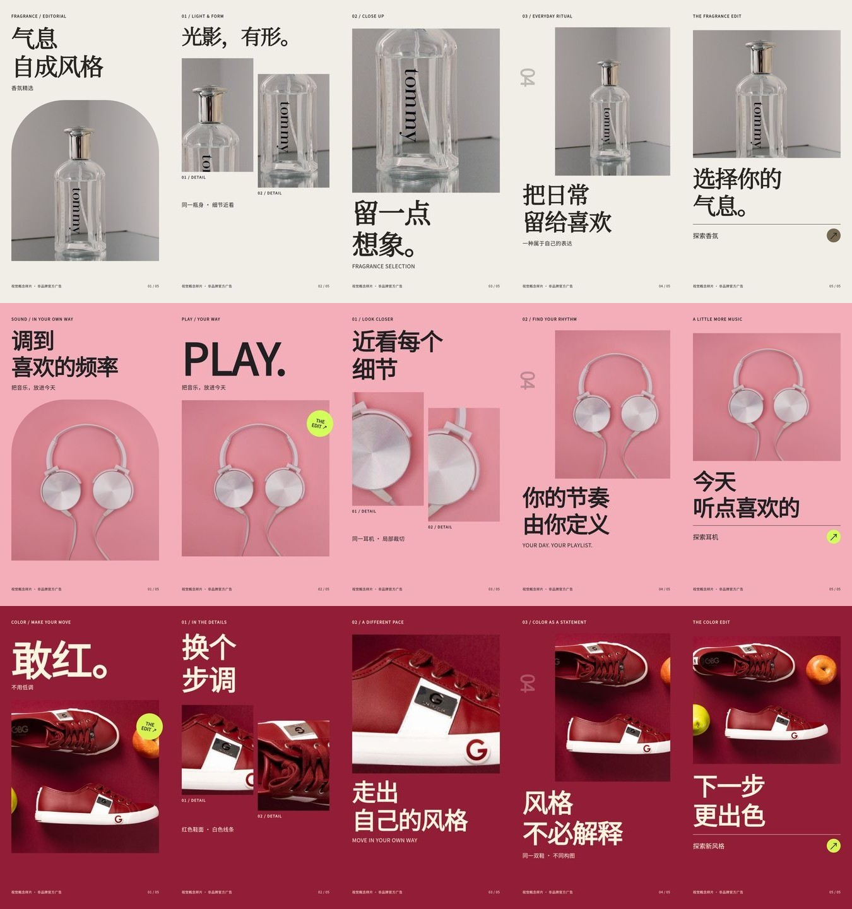

# 商品宣传视频：三组输入 / 输出 Demo

这里保存的是 **reference-author（专门编排的质量参考样片）**，用于确定下一阶段的视觉目标和演示输入输出关系。不是现有产品 Agent 实时生成结果，不是竞品成片，不代表商用授权或85分盲评已完成。

## 直接看结果

| 示例 | 输入照片 | 输入要求 | 输出视频 | 关键画面 |
|---|---|---|---|---|
| 香氛：15秒，奶油白、编辑式排版 | [原图](01-fragrance/input.jpg) | [Prompt](01-fragrance/PROMPT.md) / [请求](01-fragrance/request.json) | [1080p MP4](01-fragrance/final.mp4) | [分镜总览](01-fragrance/storyboard.jpg) |
| 耳机：15秒，粉色、大字与错位细节 | [原图](02-headphones/input.jpg) | [Prompt](02-headphones/PROMPT.md) / [请求](02-headphones/request.json) | [1080p MP4](02-headphones/final.mp4) | [分镜总览](02-headphones/storyboard.jpg) |
| 红色休闲鞋：12秒，深红、方向转场 | [原图](03-sneakers/input.jpg) | [Prompt](03-sneakers/PROMPT.md) / [请求](03-sneakers/request.json) | [1080p MP4](03-sneakers/final.mp4) | [分镜总览](03-sneakers/storyboard.jpg) |

将仓库完整拉取到本机后，直接用浏览器打开本目录的 **index.html**，即可看到原图、要求和输出视频的左右对照。这个 index 是演示导航页，不是剪辑器或 HyperFrames Studio。也可以直接播放每个目录里的 final.mp4，不依赖 Codex 登录。

## 每组包含什么

每组目录都保留原始照片、原图裁切后的工作图片、中文 Prompt、request.json、可编辑分镜 document.json、DESIGN.md、原生 HyperFrames HTML、GSAP 运行依赖、成片、封面、分镜图、自动检查报告和渲染日志。没有把图片预先拍平为静止 MP4。

同一组的局部镜头来自同一张输入照片的裁切，不用其他型号补假角度。三组均没有旁白或背景音乐，便于先评审画面；也不表示声音包装已完成。

## 参考与动效拆解

详见 [视觉基准与竞品参考](../../docs/COMMERCE-VISUAL-BENCHMARKS.md)。其中区分了 Jitter 的动效作品、Creatomate 的模板化生产和 Creatify 的生成式镜头。只学习公开可见的设计方式，不声称获得或复制其内部代码。

本包实际使用：逐行遮罩标题、照片画框揭示、内层推近、双图错位、局部裁切、方向性场景转场和片尾行动提示。背景、字体、画框和节奏分别设计，不用一层黑色遮罩和小字幕替代包装。

## 已运行的验证

[本次专用工作流](https://github.com/Metroids048/hyperframe/actions/runs/34549716978) 已完成：Node 语法检查、三组原生工程构建、浏览器布局及祖先容器裁切检查、重复 seek 检查、商品照片运动检查、HyperFrames check、实际 high-quality MP4 渲染，以及 FFprobe 输出验证。

输出规格：1080×1920、30fps；两条15秒各450帧，一条12秒360帧；无音轨。

本次额外修复了两个问题：

1. 浏览器跳转测试不能返回 GSAP Timeline 本身，因为它是 thenable，暂停状态下等待完成会超时。
2. 双图内部网格不能与整幕共用同一个 CSS 类；否则内部网格高度会错误缩短整幕。现在使用独立 detail-grid 类，并用故障注入验证检查器确实能抓住整幕被缩短的问题。

各目录 qa.json 是自动化结果，check.log 保留 HyperFrames 的原始 warning，不隐藏它们。技术检查通过不等于审美通过；本次本地容器预览服务报 TransportTimeoutError，**没有完成本轮全片人工观片和审美验收**。Windows 本机重渲染也未在本轮验证；CI 使用 Ubuntu 和系统 Noto CJK 字体。

## 复现与继续实现

生成源代码位于 ../../scripts/build-commerce-showcase.mjs；验证脚本位于 ../../scripts/verify-commerce-showcase.mjs；完整命令、固定依赖安装与渲染步骤见仓库 .github/workflows/commerce-showcase.yml。

这些样片目前通过参考编排脚本生成，document.json 是参考分镜格式，不是已经接入现有聊天服务的通用 Document v3。后续把认可的视觉方案迁入组件和 Agent 编排时，应使用新的商品素材和实际对话验收，不能直接播放本包预录视频后声称自动生成。

## 权利边界

每组 SOURCES.md 记录照片来源、摄影作者、下载哈希和裁切说明。照片中的原有品牌标识不冒充自有品牌；当前片子为非官方效果演示。真实商品广告需使用商家获授权的照片、核实文案，并完成发布审核。没有分发字体文件，也没有打包竞品视频或其音乐。
